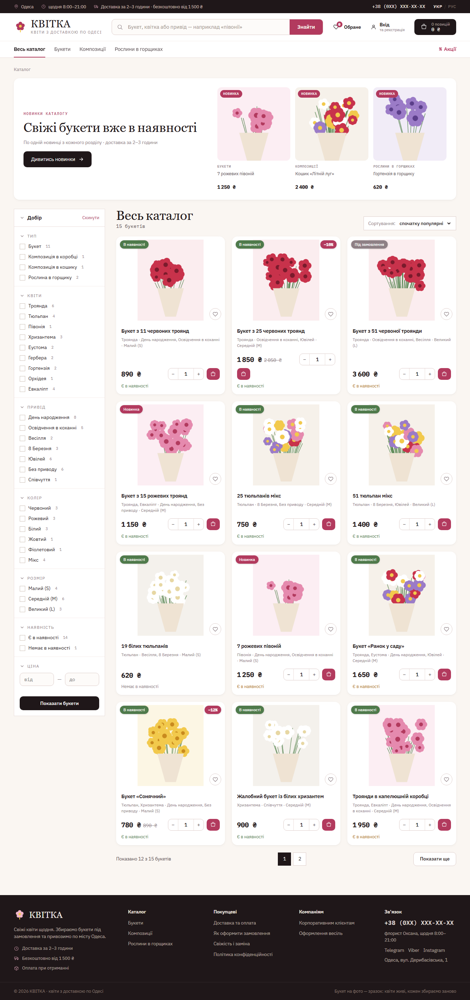
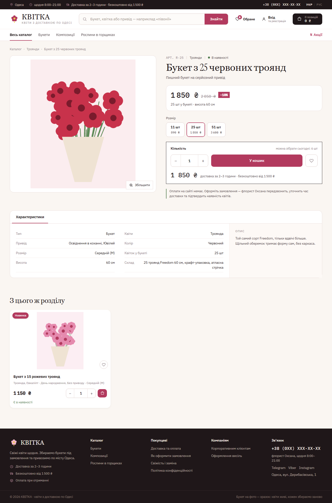
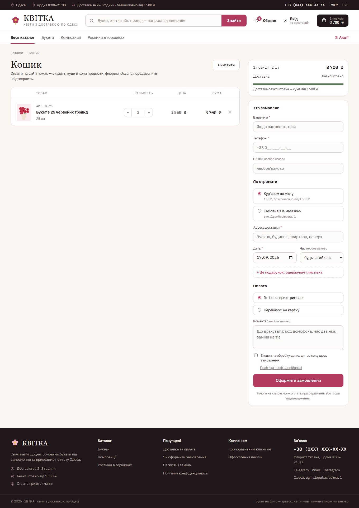
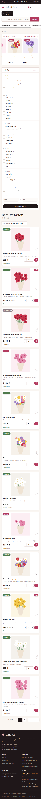

# KVITKA — flower shop with delivery

A bilingual (Ukrainian / Russian) online flower shop built with Django. Customers pick a bouquet,
choose its size, add it to the cart and place an order with courier delivery or pickup — no online
payment, the florist calls back to confirm. Everything works without JavaScript; JS only makes it
smoother.

Demo data (bouquets, categories, footer pages) is generated by management commands, product
images are drawn by Pillow — so the project runs out of the box.

## Screenshots

| Catalog with filters | Product page with size variants |
|---|---|
|  |  |

| Cart and checkout | Mobile |
|---|---|
|  |  |

## Features

**Storefront**
- Catalog with categories, faceted filters (type, flowers, occasion, colour, size), full-text search
  that works for Cyrillic, sorting (popular, price, discount, newest) and pagination.
- Product variants: one bouquet in several sizes (11 / 25 / 51 roses) with a size switcher.
- "New arrivals" banner, promo badge for discounted items, favourites.
- Session cart with a free-delivery progress bar; the free-delivery threshold and courier price live in settings.
- Checkout: courier or pickup, delivery date and time slot, recipient and gift card text, payment on delivery.
- Customer account: order history, saved phone and address, password reset by e-mail.
- Two languages with a single click; all UI strings are translated, catalog data is stored in both languages.
- SEO basics: canonical URLs, sitemap, robots.txt, Open Graph image.

**Back office**
- Django admin tuned for a florist: order list with delivery info, status badges, dashboard with recent orders.
- Deleting a reference value (e.g. a flower) unpublishes affected products instead of breaking them.
- New-order notifications to Telegram and an e-mail to the customer in their language, sent in the background.
- Telegram bot for the owner: today's deliveries, order status, stock.
- Price list export to XLSX and YML (marketplace feed) — no extra libraries.
- Admin access protection: IP allow-list plus a one-time code sent to Telegram.

**Engineering**
- 181 tests: quantity normalisation, filters, sorting, variants, cart totals, checkout, no-JS forms,
  JSON API, notifications, i18n completeness, admin guards, seed commands on an empty database.
- Custom `makelocales` / `compilelocales` commands — translations are maintained without gettext binaries.
- Consistent SQLite snapshots (`VACUUM INTO`) and a safe content-import command for deployments.
- Deployment files for a Linux server: systemd units, Caddy, Cloudflare tunnel, backups and monitoring.

## Tech Stack

- Python 3.12+, Django 5, SQLite
- Pillow (image processing and placeholder art), whitenoise (static files), waitress (WSGI server)
- Plain HTML / CSS / vanilla JavaScript — no frontend build step
- Only four runtime dependencies, no third-party Django apps

## Setup

1. Clone the repo and create a virtual environment:
   ```
   python -m venv .venv
   .venv\Scripts\activate          # Windows
   source .venv/bin/activate       # Linux / macOS
   pip install -r requirements.txt
   ```
2. Copy `.env.example` to `.env`. For a local run every value may stay empty.
3. Create the database and demo content:
   ```
   python manage.py migrate
   python manage.py seed_facets
   python manage.py seed_pages
   python manage.py seed_catalog
   python manage.py compilelocales
   python manage.py createsuperuser
   ```
4. Run the server and open http://127.0.0.1:8000/
   ```
   python manage.py runserver
   ```
5. Run the tests:
   ```
   python manage.py test
   ```

On Windows the same steps are wrapped in `.bat` files in the project root (in Russian).

## Project layout

```
catalog/   products, categories, facets, filters, search, exports, seed commands
orders/    cart, checkout, order model, notifications, Telegram bot
accounts/  login by e-mail, profile, order history, favourites
pages/     footer pages (delivery, how to order, privacy policy…)
core/      admin gate, IP access, i18n tooling, dashboard, sitemaps
deploy/    server configuration (systemd, Caddy, Cloudflare, backups)
docs/      project notes and screenshots
```

## License

Source code © ISHOD, 2026. All rights reserved. Shared for portfolio and review purposes.
